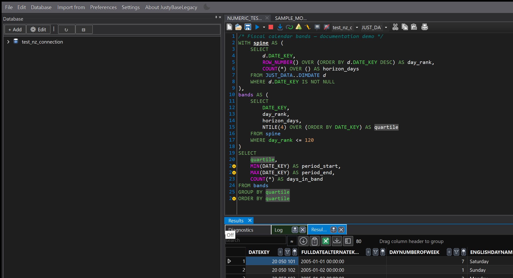
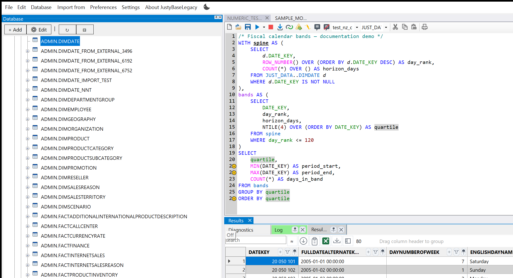
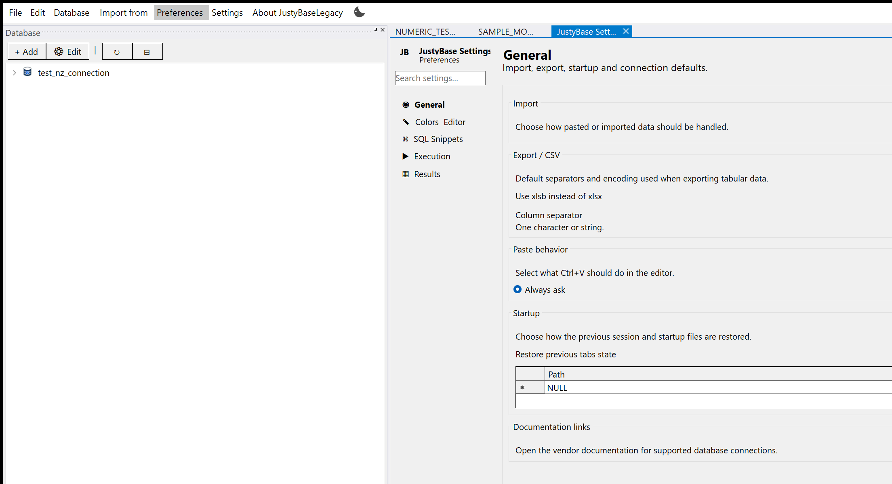
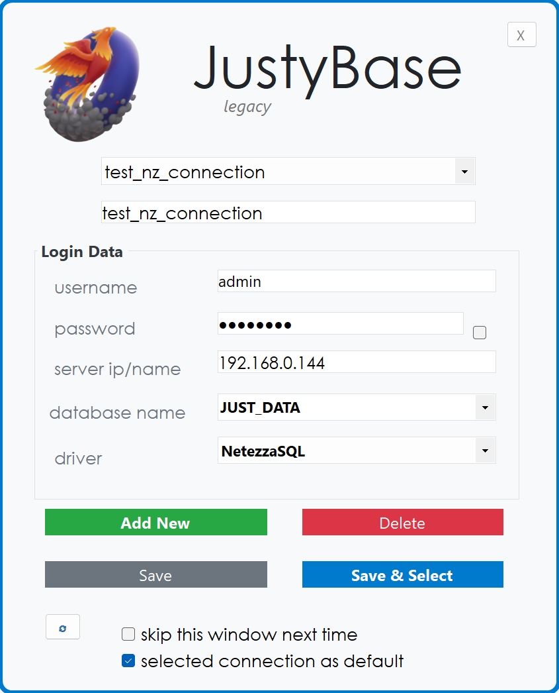
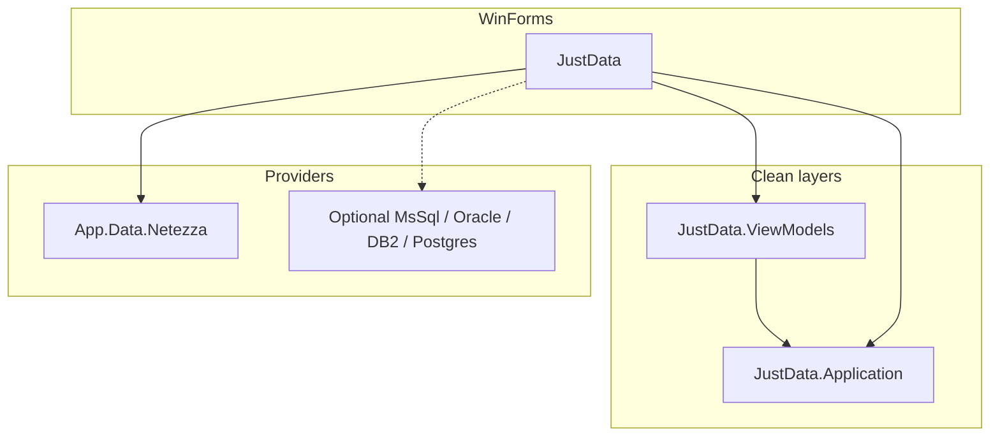

<p align="center">
  
</p>

<h1 align="center">JustyBase.Legacy</h1>

<p align="center">
  <strong>Windows SQL client for IBM Netezza</strong><br/>
  Author, explore, and ship queries with a modern desktop IDE — built on .NET&nbsp;10.
</p>

<p align="center">
  <a href="https://github.com/justybase/JustyBase.Legacy/actions/workflows/ci.yml"></a>
  <a href="https://github.com/justybase/JustyBase.Legacy/releases"></a>
  <a href="LICENSE.md"></a>
  <a href="https://dotnet.microsoft.com/"></a>
</p>

<p align="center">
  <a href="#download">Download</a> ·
  <a href="#features">Features</a> ·
  <a href="#architecture">Architecture</a> ·
  <a href="#build-from-source">Build</a>
</p>

---

<p align="center">
  
</p>
<p align="center"><sub>SQL editor, result grid, and database explorer — dark theme</sub></p>

**JustyBase.Legacy** is a solo-maintained desktop IDE focused on **IBM Netezza / PureData**.  
Write and run SQL, browse catalog objects, tune preferences in a docked settings tab, and keep connection profiles encrypted on disk.

Netezza is the default shipped provider. MS SQL, Oracle, DB2, and PostgreSQL are available as optional compile-time flags for contributors — not in the default release binary.

---

## Download

Get the latest **Windows x64** build from [GitHub Releases](https://github.com/justybase/JustyBase.Legacy/releases/latest):

- Inno Setup installer, or
- Portable ZIP (self-contained)

No separate .NET runtime install required for release packages.

---

## Screenshots

| Object explorer | Preferences (docked tab) | Login |
|:---:|:---:|:---:|
|  |  |  |
| Catalog tree & DIMDATE selection | Settings live beside SQL tabs | Encrypted connection profiles |

Light and dark themes are both first-class (`UseSpecialColoring`).

---

## Features

- **Netezza-first SQL editor** — syntax highlighting, completion, and linting aimed at NPS SQL
- **Virtual-mode result grid** — large result sets, filter/export to CSV / Excel
- **Object explorer** — connections, databases, tables; open DDL and navigate into objects
- **Docked Preferences** — General, Colors & Editor, Snippets, Execution, Results — as a document tab, not a modal
- **Encrypted profiles** — AES-GCM + DPAPI for the current Windows user ([ADR-005](docs/ADR/ADR-005-credential-encryption.md))
- **Release pipeline** — smoke test, coverage gate, NuGet audit, Inno installer + ZIP on tagged releases

---

## Architecture

Dependency direction: **UI → ViewModels → Application**.  
WinForms stays at the edge; business logic is testable without `-windows` TFMs.



| Choice | Why |
|--------|-----|
| Clean layers | Architecture tests block WinForms leaks into Application / ViewModels |
| MVVM (`CommunityToolkit.Mvvm`) | Commands, messengers, validators under unit test |
| Provider engines | `ISqlExecutionEngine` selected per connection type |
| Central Package Management | Pinned versions in `Directory.Packages.props` |

Design notes: [docs/ADR/](docs/ADR/) (six ADRs).

---

## Testing & quality

| Layer | What runs |
|-------|-----------|
| Unit / ViewModel | Services, VMs, architecture governance (~1,100+ cases in CI projects) |
| Preferences / Login | Settings and profile flows |
| UI (FlaUI) | Stable `AutomationId`s; documentation screenshots via real user paths |
| Integration | Real Netezza — **local only** ([docs/INTEGRATION_TESTS.md](docs/INTEGRATION_TESTS.md)) |

CI on `main`: restore → NuGet audit → Release build → smoke test → core tests with **≥35%** merged line coverage (Application / ViewModels typically ~90%+).

---

## Build from source

**Requirements:** Windows x64, [.NET SDK 10.0.301](https://dotnet.microsoft.com/download/dotnet/10.0) (`global.json`), NuGet.org.

```powershell
dotnet restore JustData.All.slnx
dotnet build JustData.All.slnx -c Release
dotnet test JustData.All.slnx -c Release --filter "Category!=Integration"
```

Optional provider (example):

```powershell
dotnet build JustData/JustData.csproj -c Release -p:IncludeMsSql=true
```

Self-contained publish:

```powershell
dotnet publish JustData/JustData.csproj -c Release -r win-x64 --self-contained true
```

---

## Security

- Profiles stored encrypted; keys protected with DPAPI for the current user
- Diagnostic logs under `%LOCALAPPDATA%\JustyBaseLegacy` with secret redaction
- Report vulnerabilities via [SECURITY.md](SECURITY.md)

Do not commit credentials, profile exports, or production logs.

---

## Contributing

See [CONTRIBUTING.md](CONTRIBUTING.md) for layer rules, AutomationIds, and the PR checklist.  
Changelog: [CHANGELOG.md](CHANGELOG.md).  
Maintainer publish steps: [docs/GITHUB_PUBLISH.md](docs/GITHUB_PUBLISH.md).

---

## License

Copyright (C) 2021–2026 Krzysztof Duśko.  
Released under [LGPL-3.0-or-later](LICENSE.md).
